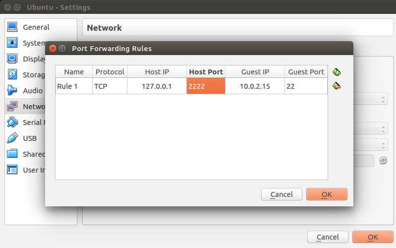
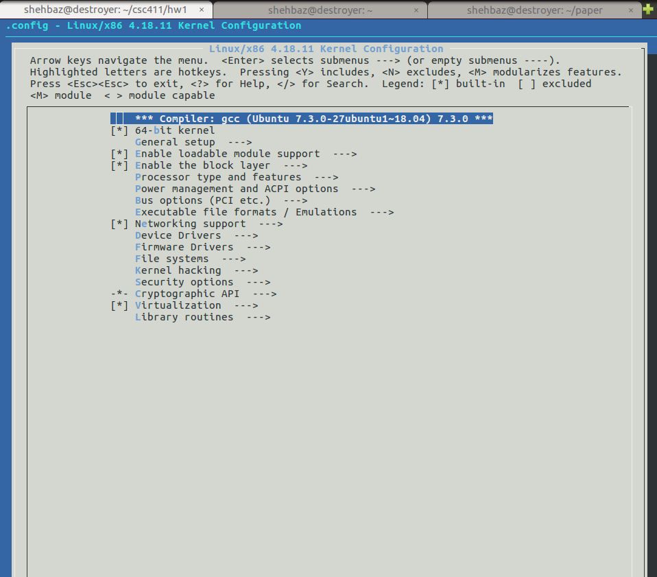
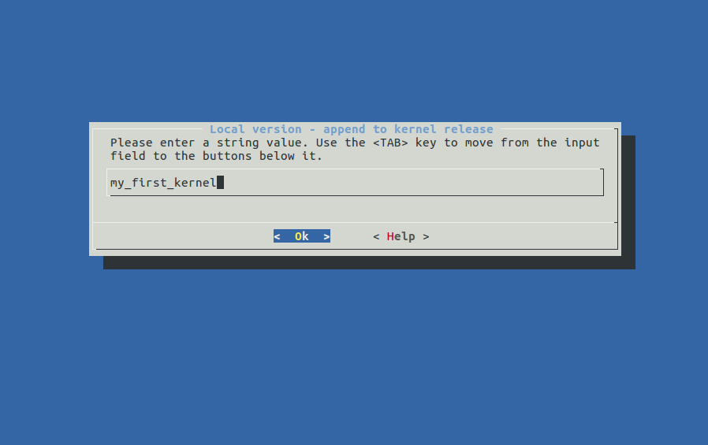

# CSC494 - Assignment 1

### Hello and welcome to CSC494!

This assignment forms the basis of all other assignments that you would be doing as a part of this course.
You would have to use your laptop/desktop which has more than 4GB memory and about 60 GB free space. If you require a separate machine, please consult the instructor.

In this assignment, you will be compiling the linux kernel, setting up a block-trace tool, and running the fio workload to capture block traces on an emulated SSD. The assignment is split into multiple parts with `checkpoints`.

Checkpoints are places where the output of your setup should match the output of the handout. If your system is not the same as the checkpoint given in the handout, consult your groupmate / other groups or email the TA before proceeding further with the assignment.

There are two documents you would have to email the TA at appropriate checkpoints in the assignment.

TA Contact: shehbaz jaffer
Email:  firstname.lastname@mail.utoronto.ca

Lets begin!


# 1. Setup Ubuntu VM using VirtualBox

- On your host system, download Ubuntu 18.04 image from here:
http://releases.ubuntu.com/18.04/ubuntu-18.04.1-desktop-amd64.iso

- Install VirtualBox from here:
https://www.virtualbox.org/wiki/Downloads

- Create a virtual machine on Virtualbox (Click New)
Select memory size as 4GB or greater
- Create virtual Hard disk now -> VDI (Virtualbox Disk Image) -> Dynamically Allocated -> 50GB space.
- Storage -> Controller IDE -> Optical Drive -> choose the CD drive image that you downloaded in step 1.
- Turn On your VM. The VM should now boot in “Live Mode” and ask you to Install Ubuntu. Select Install Ubuntu.
-	During the installation process, for the menu “Installation Type”, click on “Something else”
-	Click on “New Partition Table”
-	Click on “+” sign while selecting “free space”.
-	Create 40000 MB (40GB) of “Ext4 Journaling file system” with mount point as “/”
-	Leave the rest (about 10GB) file system as “swap area”. Note there is no mount point for swap area.
-	Click on “Install Now”  and proceed with answering simple questions.
-	Assign your username: vm
-	Assign your password : vm
-	Click on next and wait for a few minutes.
-	Go back to Vmplayer - > Your VM-> Right Click -> Close -> PowerOff
-   Go to Vmplayer -> select your VM -> start VM.

### At the end of this step, you should have your VM installed with the linux Operating System.	

Reboot your VM again. Now, Inside your vm:

- Install openssh-server
```sh
sudo apt-get install openssh-server
```
- Check the IP address of your VM using the ifconfig command inside your VM.
```sh
ifconfig
```
Keep a note of this IP address. Shutdown the VM.

- In your VirtualBox App, go to Settings of your VM, Network - > Advanced -> Port Forwarding Rules and enter the following:



Note: here Guest IP can be checked using “ifconfig” command on the guest VM. HostIP, HostPort and GuestPort remain the same as shown in figure.

- Restart your guest VM.

You should now be able to ssh to your guest VM using the following command from host:
```sh
ssh vm@localhost -p 2222
```
This way you can work from your host terminal, instead of working on a small VM screen.

`Note` for windows hosts, you may need to install Putty to get access to the VM using port forwarding as shown above.

- Increase number of processors: Go to system settings -> CPU Increase number of processors to 4

(`WARNING` - if your system makes a lot of noise/heats up during  step 2 - compilation, consider terminating the compilation process and reduce number of processors to 1).

### CheckPoint 1:

- At the end of this part, you should be able to ssh to your VM and run the following commands:
```sh
df -a
```
This would print all devices in the system, look for the following line, and copy paste this in your report:
```sh
/dev/sda1       38183144 3985128  32228664  12% /
```
Further, uname -a should return the following
```sh
uname -a
vm@vm-VirtualBox:~$ uname -a
Linux vm-VirtualBox 4.15.0-29-generic #31-Ubuntu SMP Tue Jul 17 15:39:52 UTC 2018 x86_64 x86_64 x86_64 GNU/Linux
```
Note that 4.15.0-29-generic is the linux kernel version number for Ubuntu 18.04. We are going to upgrade this kernel version by installing a more recent version in the next part of the assignment.

# 2. Compile the Linux Kernel

Download latest “stable” version of the linux kernel inside your VM. you can do this using wget on the Guest VM terminal as follows.
```sh
wget https://cdn.kernel.org/pub/linux/kernel/v4.x/linux-4.18.11.tar.xz
```
- Install necessary packages:
```sh
	sudo apt-get install make gcc libncurses-dev pkg-config bison flex libssl-dev
```
- enter root mode and untar the source code in /usr/src folder of your VM.
```sh
	sudo su
	mv linux-4.18.11.tar.xz /usr/src
	tar -xvf linux-4.18.11.tar.xz
	cd linux-4.18.11
	make menuconfig
```
This should generate a screen like this :

Add a label to your linux kernel. “General Setup-> Local version”


Save changes and exit.

- Compile your kernel, by going to /usr/src/linux-4.18.11 , and running the following commands:
```sh
sudo make -j 4 # (give 1-2 hours to compile)
sudo make modules -j 4 #(wait for 5-10 mins)
sudo make modules_install # (note the underscore, it is not an error)
sudo make install #(installs the kernel)
```

reboot your VM, note that it might take your VM 3-4 minutes to reboot. If it takes longer, the compilation did not succeed properly.

### CheckPoint 2:
uname -a should return the following:
```sh
vm@vm-VirtualBox:~$ uname -a
Linux vm-VirtualBox 4.18.11my_first_kernel #1 SMP Tue Oct 2 21:34:21 EDT 2018 x86_64 x86_64 x86_64 GNU/Linux
```
Note the linux kernel version has now changed from 4.15.0-29-generic to 4.18.11my_first_kernel

# 3. Add a workload-disk to the VM.

- Shutdown the VM. add a new disk to the VM using Settings -> Storage -> Add new SCSI disk. 

- Fix the size of the disk to 10GB and restart the VM.

- Run lsblk -l. You should see the following, among other lines in the output:
```sh
lsblk -l
sdb      8:16   0    10G  0 disk 
```

Note the number 8:16 denotes a drives major:minor number.

- Emulate the disk as an SSD. The linux OS differentiates between an HDD and an SSD using the file located here:
```
cat /sys/dev/block/8:16/queue/rotational
```
Where 8:16 is the major:minor number of the disk you found in the previous step.

For rotational =1, the device is treated as a HDD. for rotational=0, the device is treated as an SSD. we will be treating the device as an SSD. hence we need to set the flag to 0. We can do this using the following:
```
sudo su
echo “0” >  /sys/dev/block/8:16/queue/rotational
```
Create ext4 file system on the disk.
```
sudo mkfs.ext4 /dev/sdb
```
Mount the SSD disk with ext4 file system at the mount point /mnt
```
sudo mount /dev/sdb /mnt/
```


### CheckPoint 3:

Check syslog to see if mount happened successfully:
```
$ tail -5 /var/log/syslog
```
This should print something similar to:
```
Oct  3 13:59:56 vm-VirtualBox kernel: [  575.283248] EXT4-fs (sdb): mounted filesystem with ordered data mode. Opts: (null)
```
unmount the file system
```
sudo umount -l /mnt
```
Note the flag -l  (l for lazy) helps you unmount lazily

# 4. Run Workload

In this section, you would be running 2 simple workloads on the Workload-disk image that you created in the previous step, and checking if they work correctly or not:

- FIO. Install fio in your VM.
```
$ sudo apt-get install fio
```
- Read about fio options and test examples here: 
https://wiki.mikejung.biz/Benchmarking#Fio_Test_Options_and_Examples

- Run fio with atleast 5 different configuration parameters.

`Note:` 
Before each of the 5 runs:
- Unmount the file system
- Format the disk 
- Mount the file system

For each of the 5 commands, ensure that you run fio with the “--directory=/mnt” parameter.

A sample run is given here for your reference:
```
$ sudo fio --name=randwrite --ioengine=libaio --iodepth=1 --rw=randwrite --bs=4k --direct=1 --fsync=128 --size=512M --numjobs=8 --runtime=180 --directory=/mnt
randwrite: (g=0): rw=randwrite, bs=(R) 4096B-4096B, (W) 4096B-4096B, (T) 4096B-4096B, ioengine=libaio, iodepth=1
...
fio-3.1
Starting 8 processes
randwrite: Laying out IO file (1 file / 512MiB)
randwrite: Laying out IO file (1 file / 512MiB)
randwrite: Laying out IO file (1 file / 512MiB)
randwrite: Laying out IO file (1 file / 512MiB)
randwrite: Laying out IO file (1 file / 512MiB)
randwrite: Laying out IO file (1 file / 512MiB)
randwrite: Laying out IO file (1 file / 512MiB)
randwrite: Laying out IO file (1 file / 512MiB)
Jobs: 8 (f=8): [w(8)][0.6%][r=0KiB/s,w=0KiB/s][r=0,w=0 IOPS][eta 08h:45m:58s]   
randwrite: (groupid=0, jobs=1): err= 0: pid=1594: Wed Oct  3 14:45:50 2018
  write: IOPS=8, BW=32.0KiB/s (33.8kB/s)(6144KiB/186259msec)
…
Lots of lines…
...
```

### Checkpoint 4:
- List the files and directories created in /mnt folder for each of the 5 runs with their sizes. Your output should match the following:
```
$ ls -alrt /mnt/
total 4194780
drwxr-xr-x 24 root root      4096 Oct  3 06:17 ..
drwx------  2 root root     16384 Oct  3 13:53 lost+found
drwxr-xr-x  3 root root      4096 Oct  3 14:42 .
-rw-r--r--  1 root root 536870912 Oct  3 14:45 randwrite.7.0
-rw-r--r--  1 root root 536870912 Oct  3 14:45 randwrite.0.0
-rw-r--r--  1 root root 536870912 Oct  3 14:45 randwrite.3.0
-rw-r--r--  1 root root 536870912 Oct  3 14:45 randwrite.1.0
-rw-r--r--  1 root root 536870912 Oct  3 14:45 randwrite.6.0
-rw-r--r--  1 root root 536870912 Oct  3 14:45 randwrite.5.0
-rw-r--r--  1 root root 536870912 Oct  3 14:45 randwrite.2.0
-rw-r--r--  1 root root 536870912 Oct  3 14:45 randwrite.4.0
```

##### At this point, please email the TA with the output of all checkpoints in a doc/pdf file. Proceed only once the TA has acknowledged that everything is working as expected. Email your checkpoint results in a document (pdf) with the name of your groupmate. Name the document "CSC494\_A1\_PART1.pdf". Only 1 email is required per group.

# 5. blk-trace

Once the TA has confirmed your checkpoint results, you can now begin with running fio and collecting the block trace.

Install block Trace:
```
$ sudo apt-get install blktrace
```
See the different options with which blktrace can be run:
```
$ blktrace -h
```
Format and mount your disk again.

Run blktrace as a daemon on your workload-disk for 120 seconds.
```
sudo blktrace -d /dev/sdb -o myfile -w 120 &
```
While blktrace is running in the background (note the & sign in the command above)
Run the fio command:
```
sudo fio --name=randwrite --ioengine=libaio --iodepth=1 --rw=randwrite --bs=4k --direct=1 --fsync=128 --size=128M --numjobs=8 --runtime=60 --directory=/mnt
```
Once fio has completed its run above for 60 seconds, wait for blktrace to end. You can check the status of blktrace by bringing it back to foreground by using the following command on the same terminal.
```
$ fg # (wait for 1-2 mins)
sudo blktrace -d /dev/sdb -o myfile -w 120
=== sdb ===
  CPU  0:                44307 events,     2077 KiB data
  CPU  1:                71493 events,     3352 KiB data
  CPU  2:                52828 events,     2477 KiB data
  CPU  3:                90616 events,     4248 KiB data
  Total:                259244 events (dropped 0),    12153 KiB data
$
```
If your blocktrace was successful, you would have 1 or more of the following files created in your current folder, based on the number of CPUs in your system:
```
$ ls myfile.blktrace.*
myfile.blktrace.0  myfile.blktrace.1  myfile.blktrace.2  myfile.blktrace.3
```

Now that you have collected the block trace for fio, it is time to read the blktrace output.
```
blkparse -i myfile.blktrace.1
```

This outputs a lot of information. 
`SUBMIT IN DOC FILE`
Read, understand and identify each column. 
What does each column stand for? 
Can you combine all blktrace files and produce 1 consolidated output? 


Further, read blkparse and blktrace man page.
```
man blktrace
```
Read about what options we can configure blktrace and blkparse with. Specifically, read about the -a flag.

## Final Results

`SUBMIT IN DOC FILE`
Can you add one (or more) masks (-a) to blktrace to reduce the size of the block Trace log? 
Re-run with appropriate masks, analyze the change in number of blocks that get logged, and report your results in class.

Email the document of part 2 to the TA. Please add your group-mates name. The name of the document should be `CSC494\_A1\_PART2.pdf`

Hope you had fun doing this assignment!
