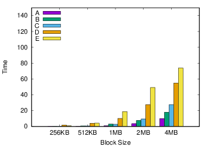

# CSC494 - Assignment 2

Hope you all had fun doing Assignment 1!

Assignment 2 builds up on Assignment 1, and we learn more about file systems and performance implications of trace tools.

The assignment is lengthy and open-ended, so we recommend starting early and asking questions on the mailing list to make sure you are proceeding on the right path.

In this assignment we will be analyzing block trace logs of 3 different file systems - ext4, Btrfs and F2FS.
You should answer all questions and email a writeup titled CSC494.A2.pdf.

TA Email: shehbaz.jaffer@mail.utoronto.ca

Assignment Release Date: Oct 27th

Assignment End Date: Nov 8th, 4.59PM.

If you are not able to complete the assignment, please make sure you send a writeup/email to the TA with an update on the current status of your assignment.

# 1. File Systems

Using the same workload disk setup that you created as part of Assignment 1, we now create different file systems on our workload disk. Note that for this assignment, you should use a workload disk of atleast 20GB in size. If your workload disk size is different, please mention this in your report.

## 1.1 ext4 file system

We first start with ext4. ext4 is a log structured file system. i.e. it maintains a log on which it updates metadata before updating the actual file system. Answer the following questions:

- Q1 - List the 3 different logging modes in ext4. How are they different from each other?
(Hint: look at the "data" option in mount command for ext4.

- Q2 - Which mode is the most efficient (high-performance) mode? Why? Is it reliable?

- Q3 - Which mode is the most reliabile mode? Why? Is it efficient?

## 1.2 Btrfs File System

The Btrfs file system is a Copy on write file system - i.e. it never updates a block in place. When an overwrite occurs, it writes to another position on the disk, making it very suitable for flash drives.

- Q1 - Create a btrfs File system on your workload device. Read the log that is created. In particular, look at "Metadata" parameter in "Block group Profiles".

- Q2 - Change the disk SSD, and recreate the btrfs file system. 
```
sudo su
echo “0” >  /sys/dev/block/8:16/queue/rotational
```

Note: here 8:16 is the major/minor device number. Please refer Assignment 1 for more details.

- Q3 - look at the "Metadata" parameter in "Block Group Profiles". Do you see a difference? What could be the reason for this difference between SSD and HDD mode? If you don't see a difference, please email TA/mailing list.

We will be performing experiments in both SSD and HDD mode.

## 1.3 F2FS File System

Briefly go through the slides of F2FS file system [here](https://www.usenix.org/sites/default/files/conference/protected-files/fast15_slides_lee.pdf)

- Q1 - Mention atleast 3 reasons (and elaborate) why F2FS is better than ext4 and Btrfs.

- Q2 - What type of workloads do you think would lead to performance drop in F2FS?

# 2 Performance Analysis of Trace Tools

You will be repeating the following two experiments (``dd`` and ``fio``) for all three file systems. 

For ext4, you would analyze the file system for 3 journal modes - ordered, journal and writeback.

For btrfs, you will analyze the file system for HDD and SSD mode.

For f2fs, use the default mode.

First, format the file system using mkfs command. For ext4, mkfs can be run as is. For btrfs, change the disk type (/dev/queue/rotational) to HDD or SSD. For f2fs, mkfs can be run as is.

Second, mount the file system to a mount point, as you have done in A1. Here, for ext4, you need to select the journal mode. you can select this with data=ordered|journal|writeback option.

For each mode, do the following two analysis:

## 2.1 dd

- Q1 - Use the dd command to write data to disk. fill the entire disk (do not use the count parameter of dd, it would continue writing until there is no more space left on device). Vary block size (bs) parameter and plot the amount of time it takes for 3 different block sizes - 4K, 256K, 1M. Plot graph showing the time taken to fill the disk v/s block size for all 6 file system configurations.

One representation could be a clustered histogram of time taken for each block size. As shown below written in [gnuplot](https://packages.ubuntu.com/trusty/math/gnuplot). Feel free to use your own plot tools/scripts and add them to your report:



```python 
!/usr/bin/env gnuplot

set term postscript eps noenhanced color solid 22
set output 'bar.eps'

set style data histogram
set style histogram cluster gap 1

set key inside left

set xlabel 'Block Size'
set ylabel 'Time'

set style fill solid border rgb "black"
set auto x
set yrange [0:150]
plot 'ext4.dat' using 2:xtic(1) title col, \
        '' using 3:xtic(1) title col, \
        '' using 4:xtic(1) title col, \
        '' using 5:xtic(1) title col, \
        '' using 6:xtic(1) title col
```

- Q2 - Which block size takes least time to fill the disk across all 6 configurations (3 - ext4, 2 - btrfs and default f2fs mode). Plot data to justify your answer.
- Q3 - Which file system mode of operation (for ext4, btrfs) is the fastest? Plot data to justify your answer.
- Q4 - Which file system is the fastest? Plot data to justify your answer.

## 2.2 fio

dd is an inefficient way to perform profiling of disks, as it is single threaded. Most real-world applications are multi-threaded and utilize the disk more efficiently. We now revisit fio and run the fio command with and without block trace. The objective is to find out if enabling or disabling block trace would lead to significant performance drop in fio. Note that disk throughput should ideally be higher with fio than with dd.

- Q1 - run fio on your device with 4 threads for 5 minutes. show the effect of varying the following parameters on ext4(data=ordered mode), btrfs(SSD mode) and default F2FS mode:

1. readwrite
2. ioengine
3. iodepth
4. fsync
5. fdatasync

Bonus: read the man page of fio. Identify any other parameters that you feel would effect fio run on the file system. Just mention them in your report with a brief description. Discuss these in class.

fio terminates with the following output:

```
Jobs: 1 (f=1): [m(1)] [100.0% done] [75500KB/25672KB/0KB /s] [18.9K/6418/0 iops] [eta 00m:00s]
test: (groupid=0, jobs=1): err= 0: pid=18107: Sat Oct 27 13:06:18 2018
  read : io=3071.7MB, bw=75628KB/s, iops=18907, runt= 41590msec
  write: io=1024.4MB, bw=25220KB/s, iops=6305, runt= 41590msec

```

draw meaningful graphs (max -5 ) showing how each parameter effects each file systems I/O throughput and bandwidth (io and nw parameters for write operation). Describe main observations of each graph in not more than 3 sentences. Note down the read I/O throughput and bandwidth in a table. No graph required.

## 2.3 Revisiting blktrace

As we have seen in A1, blkTrace is very verbose. We would like to reduce and extract only relevant information from blktrace. In order to do this, we run blktrace in "live" mode, where selective block writes done by each CPU is directly parsed by blkparse written to the terminal.

These parsed selective writes can be saved in a file instead of saving the entire blktrace.

- Open 2 terminals. Create an ext4 file system in one terminal and mount the disk. On the second terminal, run blktrace and blkparse together in live mode as follows:

```
	sudo blktrace -d /dev/sdb -w 30 -o - | blkparse -a fs -i -
```

Make sure you understand what each option stands for. Now go back to the first terminal, and run a dd command:

```
	sudo dd if=/dev/zero of=/mnt/myfile bs=4096 count=10
```

Note that we are writing 10 blocks, each 4KB in size, to ext4 file system.

You should get an output similar to the following in the second terminal:

```
$ sudo blktrace -d /dev/sdb -w 30 -o - | blkparse -a fs -i -
  8,16   2        4     0.000012943 16831  I   W 274432 + 80 [dd]
  8,16   2        6     0.000027266 16831  D   W 274432 + 80 [dd]
  8,16   2        7     0.000181584 16831  C   W 274432 + 80 [0]
  8,16   1       12     5.243222997 16800  I  WS 8650888 + 40 [jbd2/sdb-8]
  8,16   1       14     5.243232313 16800  D  WS 8650888 + 40 [jbd2/sdb-8]
  8,16   1       15     5.243453109     0  C  WS 8650888 + 40 [0]
  8,16   1       18     5.243498828 16800  I  WS 8650928 + 8 [jbd2/sdb-8]
  8,16   1       19     5.243503175 16800  D  WS 8650928 + 8 [jbd2/sdb-8]
  8,16   1       20     5.243670258     0  C  WS 8650928 + 8 [0]

```

Here, the `-a fs` command ensures only writes happening through the file system module is captured and parsed. 

- Q1 - identify what each column stands for in the blktrace. Look at column 6. We are only interested in values with "C". explain why. Look at column 7. what do W and WS stand for? explain. Look at column 9. we see writes from not only dd but also by jbd2. what is jbd2?

- Q2 - you wrote 10 blocks each 4KB in size. the 8th column shows a number + 80. what does the number stand for? what does the 80 stand for? why is it 10 and not 80? (Hint: 1 sector = 512 bytes).

- Q3 - re-run fio on your device for 5 mins, with 2 of the best configurations (maximum throughput) for all 3 file system modes that you ran in 2.2. This time, enable blktrace in live mode. Report the throughput and compare with the previous non-blocktrace fio run in a graph.

- Q4 - report the size of the blktrace file captured, by only looking at "C"ompleted block traces. which are "W"ritten both asynchronously or "W"ritten "S"ynchronously. report your log file size for each of the 6 configuration runs for Q3.

- Q5 - finally run fio for 20 minutes for any fio configuration in default file system mode.
	- Bryan and KC - ext4
	- Yuhan and Fukka - btrfs
	- Tony and Jialun - f2fs

and report block trace size (when blktrace is enabled) and overhead of running fio with and without blktrace (io / throughput comparision).

For any questions or clarifications, please do not hesitate to send a email to the mailing list or the TA.
